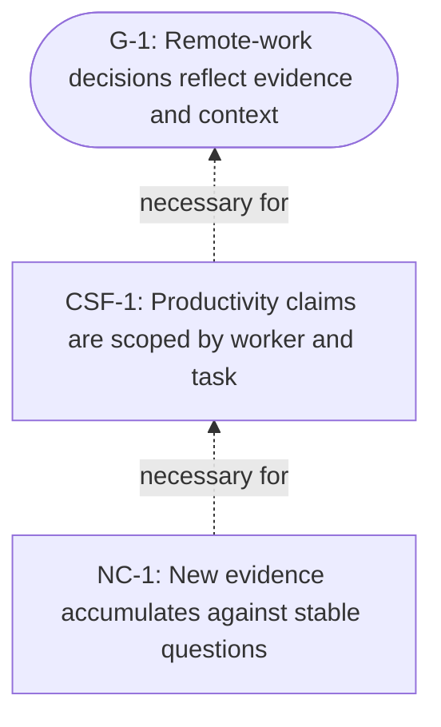

<!-- Generated by ltp. Do not edit this file; edit ltp/ltp-model.yaml and run `ltp sync`. -->

# Goal Tree

| ID | Kind | Statement | Satisfaction | Influence | Criterion |
|---|---|---|---|---|---|
| G-1 | goal | Remote-work decisions reflect evidence and context | unknown | influence |  |
| CSF-1 | critical_success_factor | Productivity claims are scoped by worker and task | unknown | influence | each claim names its population and task |
| NC-1 | necessary_condition | New evidence accumulates against stable questions | unknown | influence | each finding maps to a question node |

## Necessity

| Claim | Necessary for | Assumptions |
|---|---|---|
| NEC-1 | CSF-1 -> G-1 | - |
| NEC-2 | NC-1 -> CSF-1 | - |

## Diagram

