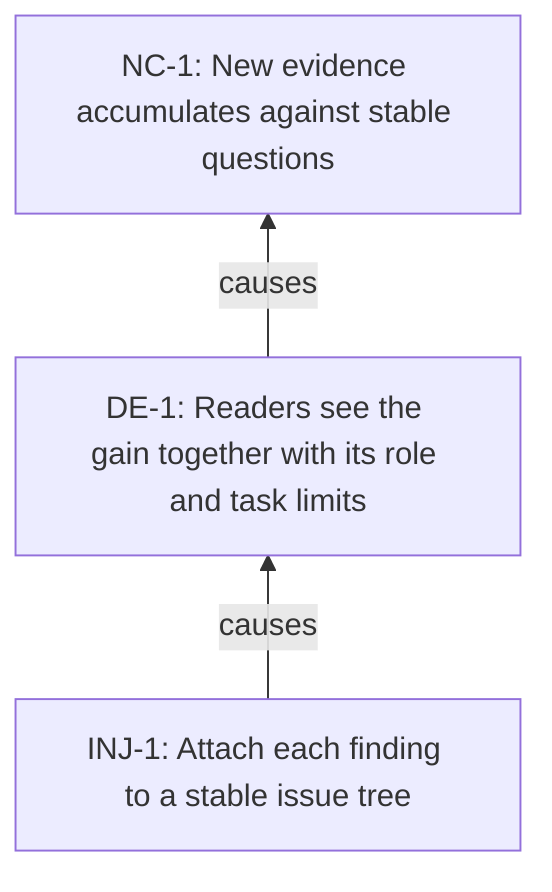

<!-- Generated by ltp. Do not edit this file; edit ltp/ltp-model.yaml and run `ltp sync`. -->

# Future Reality Tree

## Injections

| ID | Statement | Confidence |
|---|---|---|
| INJ-1 | Attach each finding to a stable issue tree | medium |

## Causal claims

| Claim | Logic | Operator | Confidence | Assumptions | CLR |
|---|---|---|---|---|---|
| CLM-3 | INJ-1 => DE-1 | single | medium | ASM-1 | yes |
| CLM-4 | DE-1 => NC-1 | single | medium | - | yes |

## Predicted effects

| ID | Source | Expectation | Result | Statement |
|---|---|---|---|---|
| PRED-1 | CLM-1 | should_exist | observed | Unqualified generalizations recur across reports |

## Diagram

