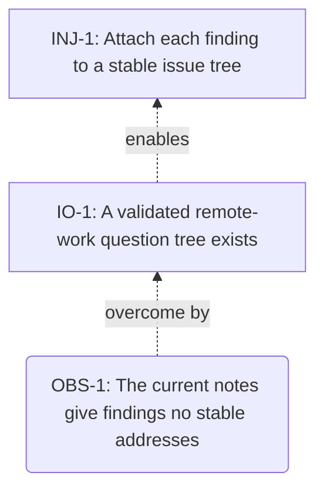

<!-- Generated by ltp. Do not edit this file; edit ltp/ltp-model.yaml and run `ltp sync`. -->

# Prerequisite Tree

## Obstacles and intermediate objectives

| Obstacle | Statement | IO | IO statement |
|---|---|---|---|
| OBS-1 | The current notes give findings no stable addresses | IO-1 | A validated remote-work question tree exists |

## Diagram

