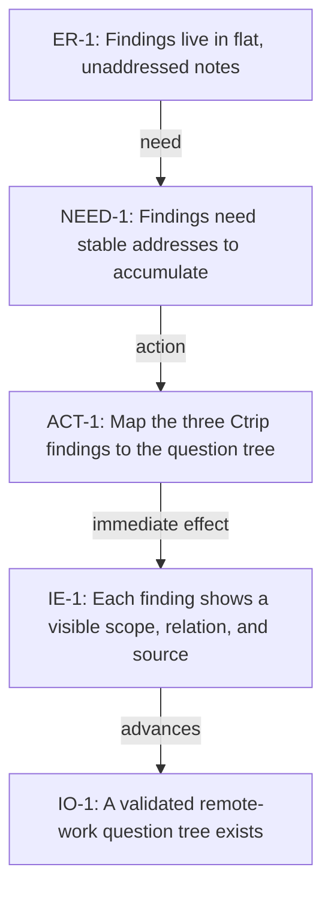

<!-- Generated by ltp. Do not edit this file; edit ltp/ltp-model.yaml and run `ltp sync`. -->

# Transition Tree

## TR-1

| Field | Value |
|---|---|
| Existing reality | Findings live in flat, unaddressed notes |
| Need | Findings need stable addresses to accumulate |
| Action | Map the three Ctrip findings to the question tree |
| Immediate effect | Each finding shows a visible scope, relation, and source |
| Advances | IO-1 |
| Preconditions | - |
| Likely scope | notes/tree.md |
| Verification | manual_check |
| Estimated size | small |
| Rollback | - |

## Diagram

