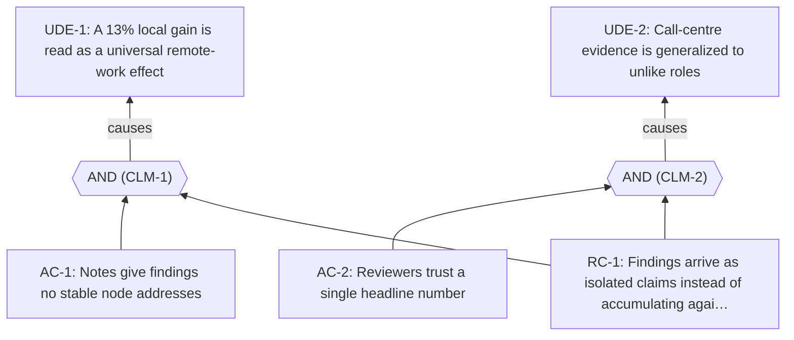

<!-- Generated by ltp. Do not edit this file; edit ltp/ltp-model.yaml and run `ltp sync`. -->

# Current Reality Tree

## Undesirable effects

| ID | Statement | Basis |
|---|---|---|
| UDE-1 | A 13% local gain is read as a universal remote-work effect | observed |
| UDE-2 | Call-centre evidence is generalized to unlike roles | observed |

## Causal claims

| Claim | Logic | Operator | Confidence | Assumptions | CLR |
|---|---|---|---|---|---|
| CLM-1 | RC-1 ALL AC-1 => UDE-1 | all | medium | ASM-1 | yes |
| CLM-2 | RC-1 ALL AC-2 => UDE-2 | all | medium | ASM-1 | yes |

## Diagram

