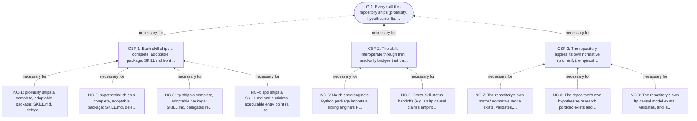

<!-- Generated by ltp. Do not edit this file; edit ltp/ltp-model.yaml and run `ltp sync`. -->

# Goal Tree

| ID | Kind | Statement | Satisfaction | Influence | Criterion |
|---|---|---|---|---|---|
| G-1 | goal | Every skill this repository ships (promisify, hypothesize, ltp, and eventually zpd) is independently adoptable in a real target repository, keeps its own declarations/entities/claims free of another skill's status dimensions, and is verifiable by that skill's own deterministic tooling. | partial | influence | Every skill in agency-engineering.yaml reads maturity: shipped, each ships a passing automated test suite, no shipped skill's package imports a sibling's package, and this repository's own .norms/, research/, and self-model instances all validate against that skill's own CLI. |
| CSF-1 | critical_success_factor | Each skill ships a complete, adoptable package: SKILL.md front matter, delegated reference docs, and an automated, repeatable verification suite for its own tooling. | partial | influence |  |
| CSF-2 | critical_success_factor | The skills interoperate through thin, read-only bridges that parse each other's generated output formats, never importing or duplicating each other's object models. | satisfied | influence |  |
| CSF-3 | critical_success_factor | The repository applies its own normative (promisify), empirical (hypothesize), and causal (ltp) tooling to itself, not only to hypothetical or third-party target projects. | satisfied | influence |  |
| NC-1 | necessary_condition | promisify ships a complete, adoptable package: SKILL.md, delegated references, and its own automated test suite for scripts/norms.py. | satisfied | control | promisify/SKILL.md exists with non-empty name/description; promisify/references/ has one document per delegated workflow; `cd promisify && python3 -m pytest` exits 0. |
| NC-2 | necessary_condition | hypothesize ships a complete, adoptable package: SKILL.md, delegated references, and its own automated test suite. | satisfied | control | hypothesize/SKILL.md exists; hypothesize/references/ has 3 delegated docs; `PYTHONPATH=src python3 -m pytest -q` in hypothesize/ exits 0. |
| NC-3 | necessary_condition | ltp ships a complete, adoptable package: SKILL.md, delegated references, and its own automated test suite. | satisfied | control | ltp/SKILL.md exists; ltp/references/ has one document per delegated workflow plus a generated schema; `PYTHONPATH=src python3 -m pytest -q` in ltp/ exits 0. |
| NC-4 | necessary_condition | zpd ships a SKILL.md and a minimal executable entry point (a script or module, plus at least one automated test) -- the same shape promisify, hypothesize, and ltp already have. | unsatisfied | control | `find zpd -iname SKILL.md` returns a match whose front matter declares non-empty name/description; zpd has at least one executable script/module and one passing automated test. |
| NC-5 | necessary_condition | No shipped engine's Python package imports a sibling engine's Python package. | satisfied | control | research/portfolio.toml's CAP-NO-CROSS-IMPORT reads capability status "implemented" under `hypothesize --root . check`. |
| NC-6 | necessary_condition | Cross-skill status handoffs (e.g. an ltp causal claim's empirical status, folded in from a hypothesize research-status.json) update only the receiving skill's own field, never the donor skill's owned status. | satisfied | control | research/portfolio.toml's CAP-BRIDGE-SEPARATION reads capability status "implemented"; its linked scenarios show a falsified empirical import leaves clr.*.result unchanged and appends a contradiction note rather than deleting or reversing the claim. |
| NC-7 | necessary_condition | The repository's own .norms/ normative model exists, validates, and is kept current. | satisfied | control | `python3 promisify/scripts/norms.py validate .` reports 0 errors. |
| NC-8 | necessary_condition | The repository's own hypothesize research portfolio exists and its publication is current. | satisfied | control | `hypothesize --root . check` exits 0 and reports the generated publication is current. |
| NC-9 | necessary_condition | The repository's own ltp causal model exists, validates, and is kept current. | satisfied | control | `ltp --model self-model/ltp-model.yaml validate --strict` exits 0 and `ltp --model self-model/ltp-model.yaml check` reports the generated projections are current. |

## Necessity

| Claim | Necessary for | Assumptions |
|---|---|---|
| NEC-1 | CSF-1 -> G-1 | - |
| NEC-2 | CSF-2 -> G-1 | - |
| NEC-3 | CSF-3 -> G-1 | - |
| NEC-4 | NC-1 -> CSF-1 | - |
| NEC-5 | NC-2 -> CSF-1 | - |
| NEC-6 | NC-3 -> CSF-1 | - |
| NEC-7 | NC-4 -> CSF-1 | - |
| NEC-8 | NC-5 -> CSF-2 | - |
| NEC-9 | NC-6 -> CSF-2 | - |
| NEC-10 | NC-7 -> CSF-3 | - |
| NEC-11 | NC-8 -> CSF-3 | - |
| NEC-12 | NC-9 -> CSF-3 | - |

## Diagram

