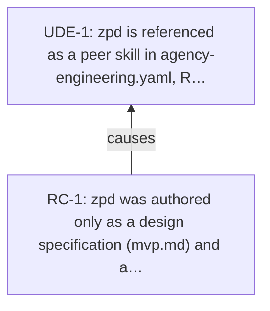

<!-- Generated by ltp. Do not edit this file; edit ltp/ltp-model.yaml and run `ltp sync`. -->

# Current Reality Tree

## Undesirable effects

| ID | Statement | Basis |
|---|---|---|
| UDE-1 | zpd is referenced as a peer skill in agency-engineering.yaml, README.md, and agency-ui, but pointing an agent or user at zpd/ to adopt or invoke it currently finds only a design specification and a design-tool export archive, not a packaged, invocable skill. | observed |

## Causal claims

| Claim | Logic | Operator | Confidence | Assumptions | CLR |
|---|---|---|---|---|---|
| CLM-1 | RC-1 => UDE-1 | single | high | ASM-1 | yes |

## Diagram

