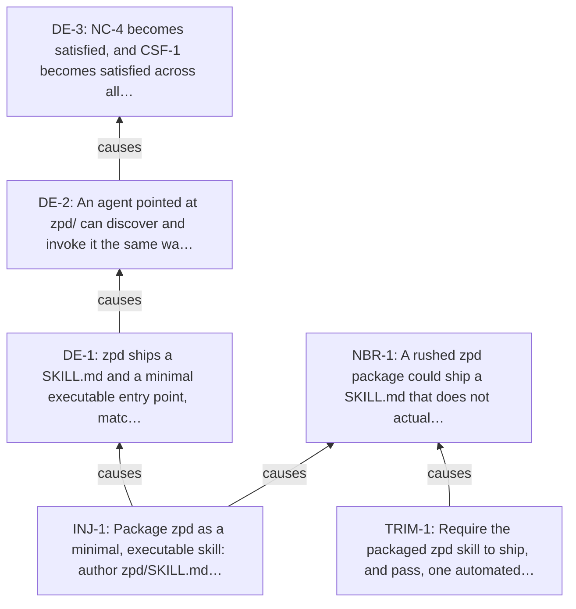

<!-- Generated by ltp. Do not edit this file; edit ltp/ltp-model.yaml and run `ltp sync`. -->

# Future Reality Tree

## Injections

| ID | Statement | Confidence |
|---|---|---|
| INJ-1 | Package zpd as a minimal, executable skill: author zpd/SKILL.md following the existing front-matter contract, define a minimal on-disk record format for the MVP's append-only assessments/estimates, and add at least one automated test -- including one that demonstrates the hard promisify-dependency refusal path -- before treating zpd as shipped. | medium |

## Causal claims

| Claim | Logic | Operator | Confidence | Assumptions | CLR |
|---|---|---|---|---|---|
| CLM-2 | INJ-1 => DE-1 | single | medium | ASM-1 | yes |
| CLM-3 | DE-1 => DE-2 | single | medium | - | yes |
| CLM-4 | DE-2 => DE-3 | single | medium | - | yes |
| CLM-5 | INJ-1 => NBR-1 | single | medium | - | no |
| CLM-6 | TRIM-1 => NBR-1 | single | medium | - | no |

## Predicted effects

| ID | Source | Expectation | Result | Statement |
|---|---|---|---|---|
| PRED-1 | CLM-1 | should_exist | observed | If RC-1 is the actual and sufficient cause of UDE-1, then (a) no zpd/SKILL.md exists anywhere in the repository, and (b) the repository's own documentation should explicitly flag zpd as not-yet-shipped rather than silently treating it as equivalent to the shipped skills. |

## Diagram

