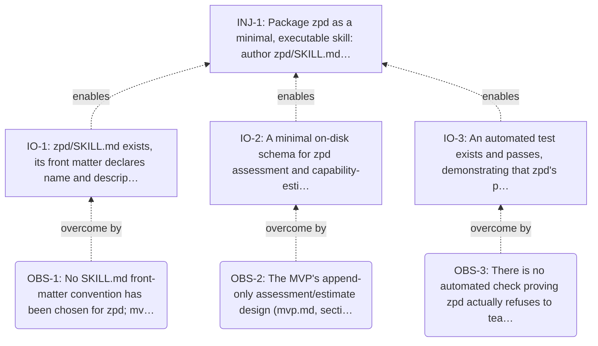

<!-- Generated by ltp. Do not edit this file; edit ltp/ltp-model.yaml and run `ltp sync`. -->

# Prerequisite Tree

## Obstacles and intermediate objectives

| Obstacle | Statement | IO | IO statement |
|---|---|---|---|
| OBS-1 | No SKILL.md front-matter convention has been chosen for zpd; mvp.md predates any packaging decision. | IO-1 | zpd/SKILL.md exists, its front matter declares name and description, and its body states zpd's non-negotiable invariants (including the hard promisify dependency) -- following the same contract promisify, hypothesize, and ltp already use. |
| OBS-2 | The MVP's append-only assessment/estimate design (mvp.md, sections 9-11) has never been reduced to a concrete, minimal on-disk record format. | IO-2 | A minimal on-disk schema for zpd assessment and capability-estimate records exists, mirroring promisify's append-only assessment convention (stable id, evidence, updated estimate, no in-place mutation of prior records). |
| OBS-3 | There is no automated check proving zpd actually refuses to teach or assess without a validated promisify domain already present. | IO-3 | An automated test exists and passes, demonstrating that zpd's packaged skill refuses to proceed when no validated promisify domain model is present for the target repository. |

## Diagram

