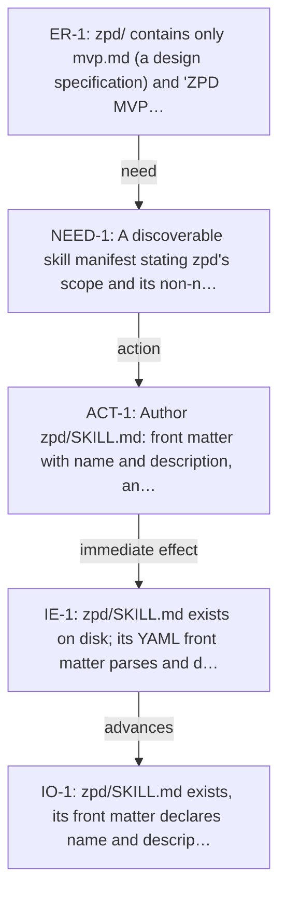

<!-- Generated by ltp. Do not edit this file; edit ltp/ltp-model.yaml and run `ltp sync`. -->

# Transition Tree

## TR-1

| Field | Value |
|---|---|
| Existing reality | zpd/ contains only mvp.md (a design specification) and "ZPD MVP implementation.zip" (a design-tool export archive); no SKILL.md exists. |
| Need | A discoverable skill manifest stating zpd's scope and its non-negotiable hard promisify dependency, in the same place an agent already looks for promisify, hypothesize, and ltp. |
| Action | Author zpd/SKILL.md: front matter with name and description, and a body stating the MVP's scope (one active job, one blocker, no curriculum) and the hard promisify-dependency refusal invariant, following the same contract as promisify/SKILL.md, hypothesize/SKILL.md, and ltp/SKILL.md. |
| Immediate effect | zpd/SKILL.md exists on disk; its YAML front matter parses and declares non-empty name and description fields, satisfying the same file-existence criterion promisify/scripts/norms.py already checks for the other three skills. |
| Advances | IO-1 |
| Preconditions | - |
| Likely scope | zpd/SKILL.md |
| Verification | manual_review |
| Estimated size | small |
| Rollback | Revert the SKILL.md addition; zpd remains documented as maturity: specified with no behavioral change to the other three skills. |

## Diagram

